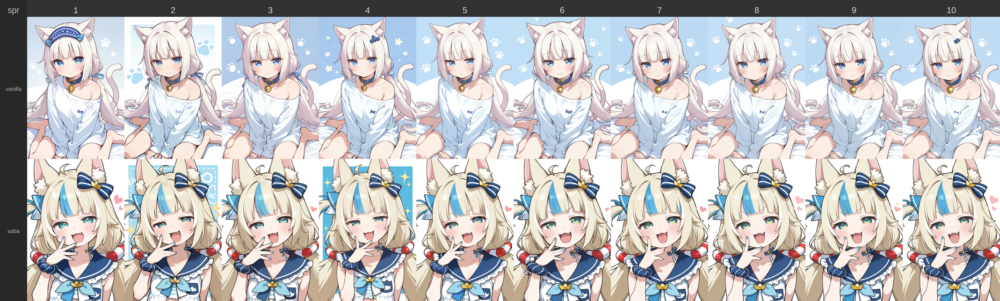
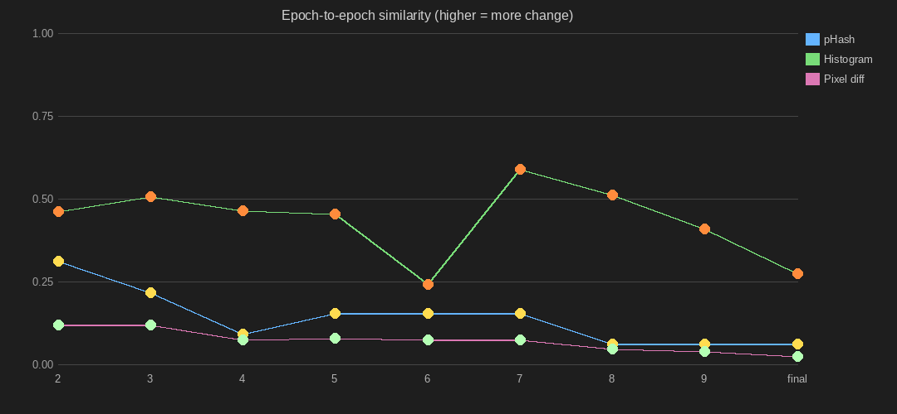

# lora-eval





Evaluate Stable Diffusion LoRAs via the ComfyUI API.

For each `.safetensors` file in the target directory, injects LoRA syntax
(and optional trigger words) into a ComfyUI workflow, queues generation for
each configured prompt, saves individual images, and produces a composite
grid (one row per prompt, one column per epoch) and a similarity graph.

## Installation

```sh
make venv-setup
make build
make install
```

## Configuration

Place `config.json` and `workflow.json` in `~/.config/lora-eval/`. Example
config:

```json
{
    "comfyui_url": "http://127.0.0.1:8188",
    "workflow_file": "workflow.json",
    "prompts": [
        {
            "label": "vanilla",
            "positive": "1girl, ...",
            "negative": "..."
        }
    ],
    "lora_weight": 1.0,
    "trigger_words": "",
    "positive_node_id": "98",
    "positive_text_field": "positive",
    "negative_node_id": "98",
    "negative_text_field": "negative"
}
```

## Usage

```sh
lora-eval /path/to/loras
```

| Argument | Description |
|---|---|
| `lora_dir` | Directory containing `.safetensors` files |
| `-c`, `--config` | Config file path (default: `~/.config/lora-eval/config.json`) |
| `-w`, `--workflow` | Workflow file path (default: from config or `~/.config/lora-eval/`) |
| `-t`, `--trigger-words` | Override trigger words from config |
| `-n`, `--dry-run` | Validate config and list LoRAs without calling the API |
| `-m`, `--method` | Similarity method(s): `phash`, `histogram`, `pixel`, `all` (default: `all`) |
| `-o`, `--overwrite` | Regenerate specific outputs: `images`, `composite`, `graph`, `json`, or `all` (comma-separated) |

## Output

- `_composite.png` — grid of all LoRAs × prompts
- `_similarity.png` — epoch-to-epoch similarity graph
- `<lora_name>.png` — individual images per LoRA/prompt
- `<lora_name>.metadata.json` — LoRA Manager metadata
